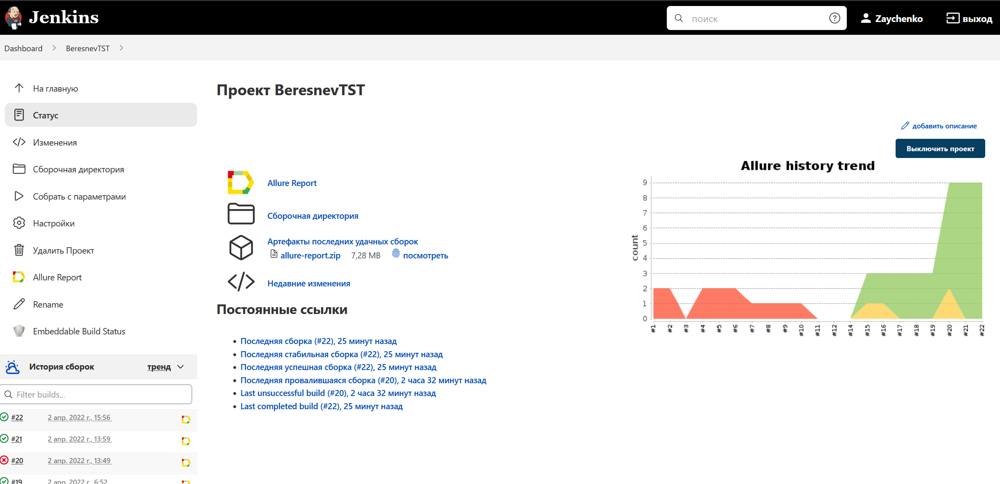
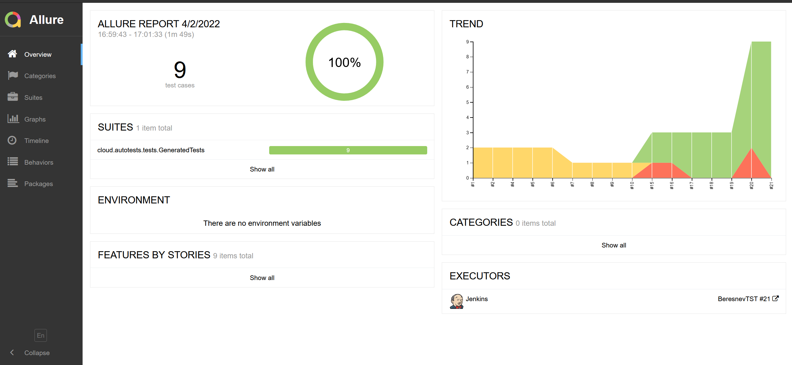
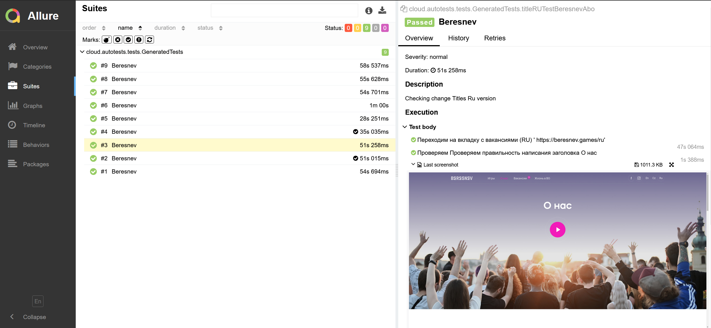
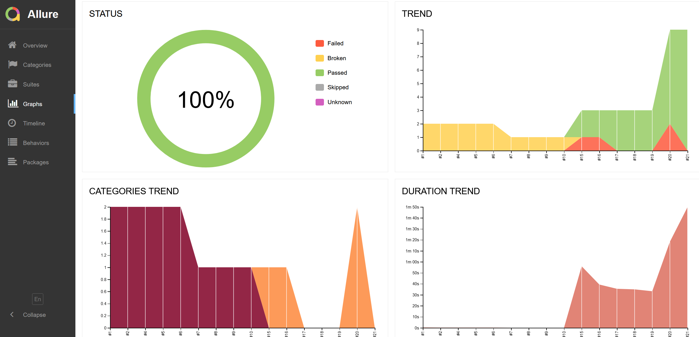
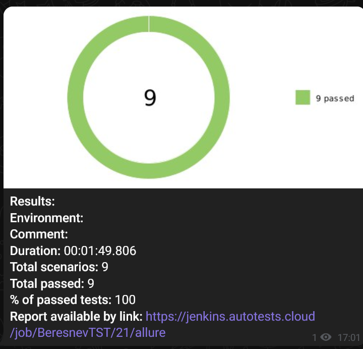

# Проект по автоматизации тестирования для beresnev.games
<a target="_blank" href="https://beresnev.games/">Игровая студия Beresnev</a>

## :see_no_evil: Содержание:

- [Реализованные проверки](#earth_africa-Реализованные-проверки)
- [Allure отчет](#earth_africa-Allure-отчет)
- [Видео примеры прохождения тестов](#earth_africa-Примеры-видео-о-прохождении-тестов)
- [Сборка в Jenkins](#earth_africa-Jenkins-job)
- [Запуск из терминала](#earth_africa-Запуск-тестов-из-терминала)
- [Интеграция с Allure TestOps](#earth_africa-Интеграция-с-Allure-TestOps)
- [Отчет в Telegram](#earth_africa-Уведомление-в-Telegram-при-помощи-бота)
- [Технологии и инструменты](#earth_africa-технологии-и-инструменты)


## :eye_speech_bubble: Реализованные проверки

- ✓ Проверка стартовой страницы RU:
    * Использование кнопки быстрой прокрутки
    * Проверка заголовка "Наши игры"
    * Проверка заголовка "Открытые вакансии"
    * Использование кнопки быстрой прокрутки к началу страницы
- ✓ Проверка стартовой страницы CZ:
    * Использование кнопки быстрой прокрутки
    * Проверка заголовка по "Naše hry"
    * Проверка заголовка по "Volná pracovní místa"
    * Использование кнопки быстрой прокрутки к началу страницы
- ✓ Проверка стартовой страницы EN:
    * Использование кнопки быстрой прокрутки
    * Проверка заголовка по "Our games"
    * Проверка заголовка по "We’re hiring"
    * Использование кнопки быстрой прокрутки к началу страницы
- ✓ Проверка правильности написания заголовка страницы "Вакансии" на трех языках.
    * Вакансии (RU)
    * Volná místa CZ
    * Careers EN
- ✓ Проверка правильности написания заголовка страницы "О нас" на трех языках.
    * О нас (RU)
    * O nás (CZ)
    * About us EN

## </a> Jenkins job
<a target="_blank" href="https://jenkins.autotests.cloud/job/BeresnevTST/">Сборка в Jenkins</a>
<p align="center">
<a href="https://jenkins.autotests.cloud/job/BeresnevTST/"></a>
</p>

### Параметры сборки в Jenkins:

- browser (браузер, по умолчанию chrome)
- browserVersion (версия браузера, по умолчанию 91.0)
- browserSize (размер окна браузера, по умолчанию 1920x1080)
- remoteDriverUrl (логин, пароль и адрес удаленного сервера selenoid или grid)
- videoStorage (адрес, по которому можно получить видео)
- threads (количество потоков)

## :speak_no_evil: Запуск тестов из терминала

Локальный запуск:
```bash
gradle clean test
```

Удаленный запуск:
```bash
clean
test
-Dbrowser=${BROWSER}
-DbrowserVersion=${BROWSER_VERSION}
-DbrowserSize=${BROWSER_SIZE}
-DremoteDriverUrl=https://user1:1234@${REMOTE_DRIVER_URL}/wd/hub/
-DvideoStorage=https://${REMOTE_DRIVER_URL}/video/
-Dthreads=${THREADS}	
```

## </a> Отчет в <a target="_blank" href="https://jenkins.autotests.cloud/job/BeresnevTST/21/allure/">Allure report</a>

### Основное окно

<p align="center">

</p>

### Тесты

<p align="center">

</p>

### Графики

<p align="center">

</p>


## </a> Уведомление в Telegram при помощи бота

<p align="center">

</p>


### </a> Примеры видео о прохождении тестов

<p align="center">
  
</p>


## :hear_no_evil: Технологии и инструменты

<p align="center">
<a href="https://www.jetbrains.com/idea/"></a>
<a href="https://www.java.com/"></a>
<a href="https://github.com/"></a>
<a href="https://junit.org/junit5/"></a>
<a href="https://gradle.org/"></a>
<a href="https://selenide.org/"></a>
<a href="https://aerokube.com/selenoid/"></a>
<a href="https://github.com/allure-framework/allure2"></a>
<a href="https://www.jenkins.io/"></a>
</p>